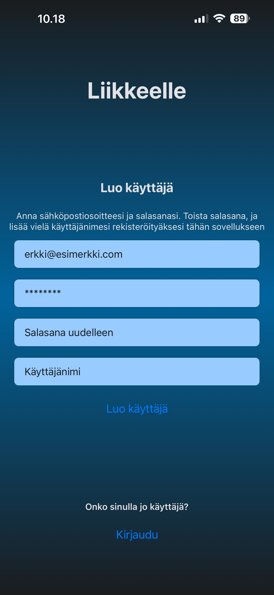
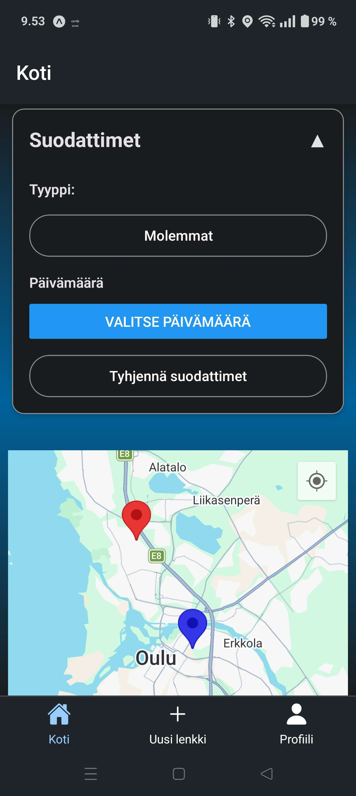
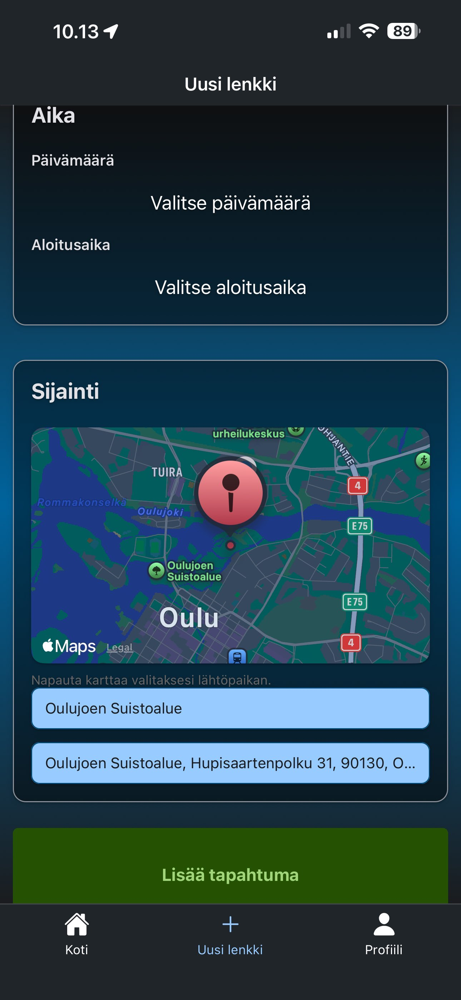
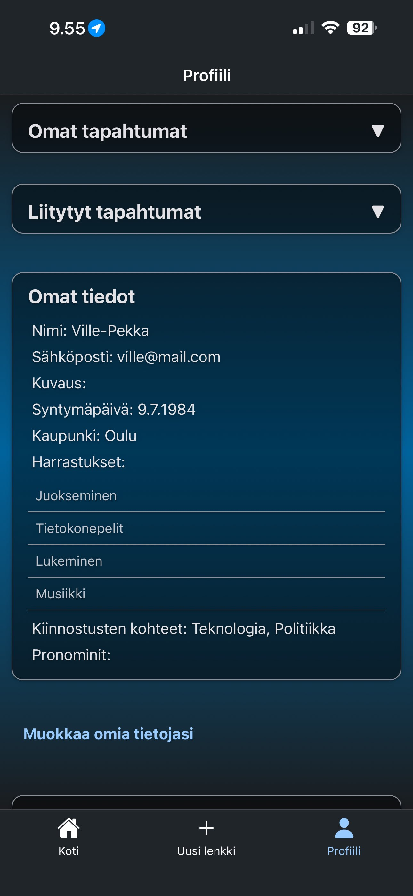
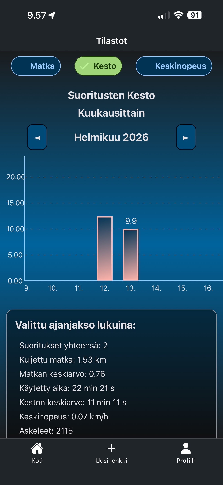

# Liikkeelle Mobile App

Liikkeelle is a social workout app which helps users find nearby workout partners.
It's a student mobile development project, built with React Native, Expo Go, Firebase Auth and Cloud Firestore.
App functionalities have been tested and work on both iOS and Android.

A demonstration video - in finnish - can be found here: [https://youtu.be/EwmQwa5Fr_8](https://youtu.be/EwmQwa5Fr_8)

## Features

**Authentication**
- User registration and login using Firebase Authentication
- Authenticated user data is stored in an AsyncStorage and shared across the app



Register screen

**Homepage**
- View all upcoming events in map view
- View five upcoming events in list view
- Filter upcoming events by:
    - Date
    - Activity type (walk or run)
- Displays the user's location on the map



Home screen on Android

**Create Event**
- Create and publish new walking or running events
- Fields:
    - Event name
    - Event type
    - Date and start time
    - Start location
    - Description



Create event screen

**Profile Page**
- View the events you have:
    - Created
    - Joined
- View and edit personal information:
    - Name
    - Description
    - Birthdate
    - City
    - Hobbies
    - Interests



Profile screen on iOS

**Statistics**
- View statistics of your walks and runs:
    - Walks/runs in total
    - Distance traveled
    - Average speed
- Monthly and yearly overviews of activity data:
    - Amount of walks/runs
    - Distance
    - Average distance
    - Time spent
    - Average duration
    - Average speed
    - Steps
- View saved exercises:
    - Duration
    - Distance
    - Steps
    - Average speed
    - Map view of the route



Exercise duration bar chart, monthly view

**Tracker**
- Track your walks and runs
- Tracker saves steps (platform native pedometer), average speed, time and distance in real time
- Floating action button, shows the state of the tracker (on or pause) and follows user around the app and takes user back to the tracker page once pressed

**Notifications**
- Homepage has a banner that displays events that start in the next hour
- In-app notifications for events you have joined

## Tech Stack
- Framework: Expo Go with React Native
- Language: TypeScript
- Styling: React Native StyleSheet with custom global styling
- Database: Firebase Cloud Firestore
- Authentication: Firebase Auth with authContext and AsyncStorage

```
src/
├── components/     # Reusable UI-komponents
├── screens/        # Screens
├── hooks/          # Custom hooks
├── services/       # Services
├── navigation/     # Navigations
├── types/          # TypeScript-types
├── config/         # Konfigurations
└── utils/          # Helpers
```

## Developed By
- Ville-Pekka Alavuotunki
- Tero Asilainen
- Kata Niva
